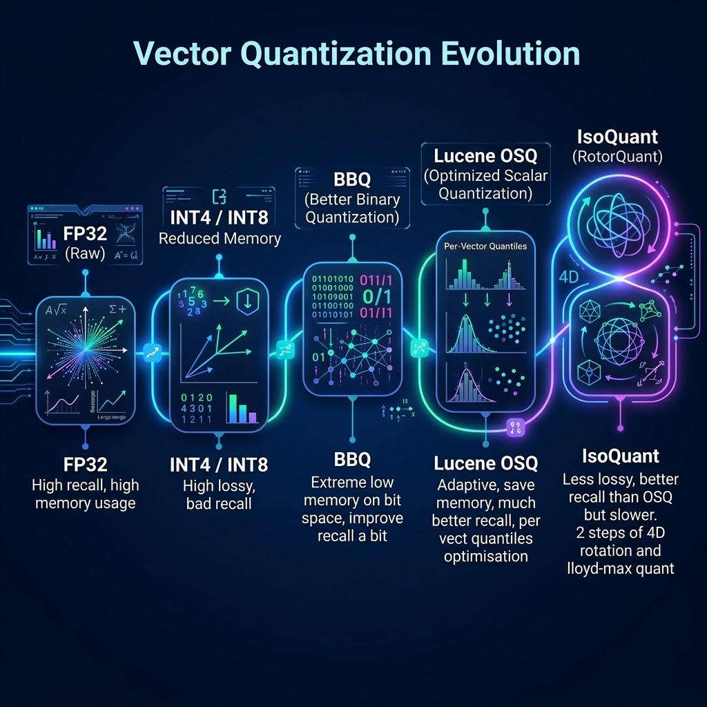
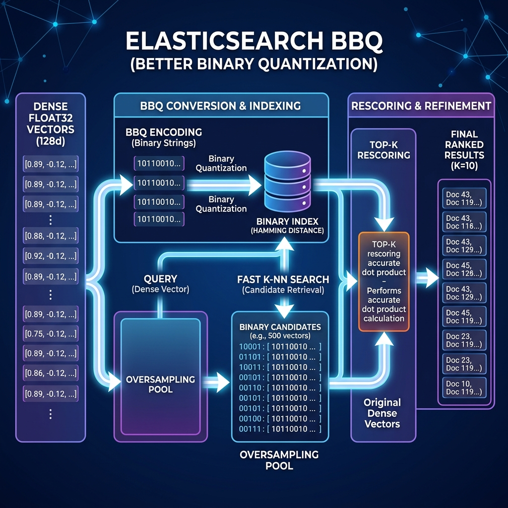
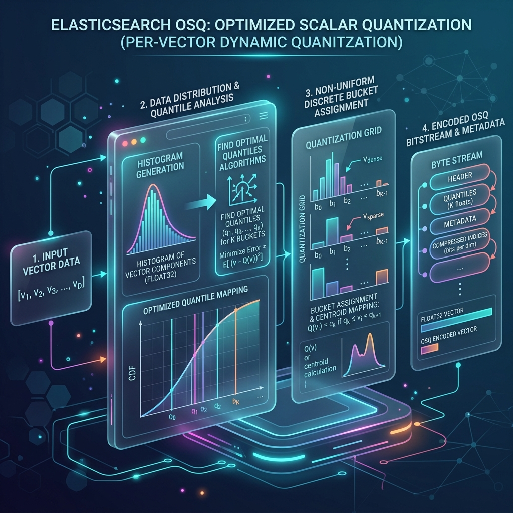
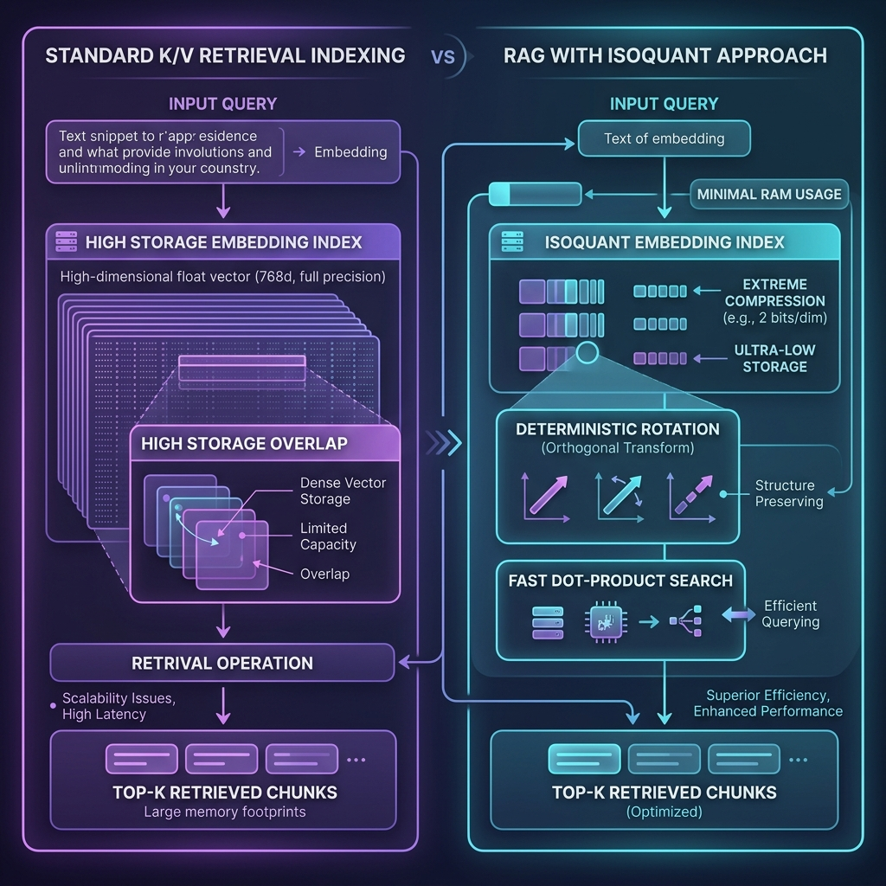

# Vector Quantization Evolution: From OSQ to IsoQuant

Recent advancements in vector search are fundamentally changing the balance between search speed and memory footprint. This article explores the progression of quantization techniques in search engines, culminating in a deep dive into an experimental **IsoQuant** implementation and how it compares to the current state-of-the-art Optimized Scalar Quantization (OSQ).

---

## 1. The Quantization Journey: Standard to OSQ

Vector search has traditionally relied on high-precision **Float32 (32-bit floating point)** representations for high-dimensional embeddings. The problem? As datasets scale to billions of vectors, the memory requirements become exorbitant, driving up infrastructure costs and introducing severe memory bandwidth bottlenecks.

### Standard Precision Reduction
The first level of optimization was straightforward precision reduction—scaling vectors down to **INT8 (Byte)** or **INT4** representations. While simple, these techniques suffered from reduced retrieval relevance, commonly known as recall degradation, because naive scalar rounding cuts away critical directional variance.

### Elasticsearch BBQ (Better Binary Quantization)
To push boundaries further, lossy binary compression techniques were introduced. [Elasticsearch's BBQ approach](https://www.elastic.co/search-labs/blog/articles/better-binary-quantization) condenses dense vectors into highly compressed bit-level binary strings. The primary approach involves a two-phase retrieval: first, the system performs an ultra-fast Hamming distance search across the extreme binary space to pull a massive "oversampled" candidate pool, and then it reranks those candidates using the original full-precision Float32 vectors to guarantee accuracy. While this achieves extreme memory reduction (up to 32x), the reranking step can heavily bottleneck search-time query latency.

### Lucene's OSQ (Optimized Scalar Quantization)
Driven directly by [Elasticsearch OSQ research and engineering](https://www.elastic.co/search-labs/blog/optimized-scalar-quantization-elasticsearch), Lucene adopted **Optimized Scalar Quantization (OSQ)** as its modern baseline to resolve the recall gap of basic scalar methods without resorting to brute-force reranking. Instead of using universal distribution bins, OSQ’s approach involves analyzing the histogram of the data space to map and compute quantiles on a *per-vector* dynamic basis. By mapping data into non-uniform discrete buckets based on these optimized quantiles, OSQ maximizes the retention of the original data's specific shape, allowing Lucene to sustain exceptional recall (over 95% on most datasets) with a minimal memory footprint.

---

## 2. Introducing RotorQuant and the IsoQuant Variant

While OSQ is highly efficient, there's another emerging approach initially designed to handle massive Key/Value (K/V) caches in large language models: the **RotorQuant** framework and its **IsoQuant** variant.

### From 3D Rotations to 4D Random Quaternions
The core mechanism of these techniques relies on a mathematically elegant property: when you rotate a high-dimensional vector using an orthogonal matrix, its energy and outliers are evenly spread across all dimensions. 

It is important to note the structural distinction here: traditional **RotorQuant** mathematically operates by rotating coordinates within **3D blocks**. The **IsoQuant** variant upgrades this architecture by splitting the vector into **4D blocks**. By operating strictly in 4D, IsoQuant is able to apply highly efficient, reproducible, random sequences of *unit quaternion rotations*. Furthermore, shifting to 4D architectures structurally aligns the calculations with **SIMD** instructions and hardware registers, ensuring flawless bit and byte memory alignments without padding.

The result? Every single dimension of the output vector begins to mirror a deterministic theoretical distribution (the Beta distribution, approaching Normal $N(0, 1/d)$ for $d \ge 64$). 

Because the distribution of the rotated coordinates is known mathematically, we can pre-compute **Lloyd-Max optimal centroids**—the absolute information-theoretically perfect scalar buckets for that specific curve. 

---

## 3. The IsoQuant Shift: From K/V to RAG

IsoQuant was originally designed to maintain constant memory boundaries in K/V caching mechanisms during generative LLM sequences. However, by adapting IsoQuant's properties into the vector retrieval space, we can revolutionize **Retrieval-Augmented Generation (RAG)** indexes. 

Unlike traditional K/V optimizations where state needs to be maintained transiently, a RAG vector index requires persistent storage. By taking the deterministic orthogonal transformation of IsoQuant and applying it to Lucene embedding fields, we transform unstructured datasets into perfectly quantized, optimally distributed scalar bytes without the expensive coordinate descent optimizations required by OSQ.

---

## 4. Deep Dive: Side-by-Side Architectural Comparison

Our experimental branch brings IsoQuant (utilizing 4-bit and 8-bit Lloyd-Max centroids with optimal 4D blocks) directly into Lucene via a custom codec format. Below is a side-by-side comparison illustrating how IsoQuant competes with OSQ across the core lifecycle of a vector search engine.

### A. Index Time Computation (Quantization Mathematics)

**1. OSQ Approach**  
During ingestion, OSQ samples the dataset to calculate specific optimal quantiles (dynamically clipped `min` and `max` bounds). By clipping outliers, it maps the core data distribution into evenly spaced buckets (e.g., `Q(x) = (x - min) / (max - min) * 255`). To maximize throughput, OSQ heavily exploits **SIMD acceleration** (like **AVX2 / AVX-512** and **Neon / SVE**) by rapidly broadcasting these targeted scalar buckets into continuous vector registers. 

**2. IsoQuant Approach**  
IsoQuant skips dynamic boundaries entirely. It splits the vector into 4D blocks, multiplying them against predefined orthogonal matrices. This rotation aggressively "smooths" out clustered outliers, forcing the entire vector space to mirror a highly predictable Normal distribution. Because the shape of the data is mathematically guaranteed in advance, IsoQuant applies its non-uniform **Lloyd-Max centroids** to fit this precise variance perfectly. Executing these rotations via Fixed Multiply-Add (FMA) instructions flawlessly aligns with modern hardware vector processors.

**3. Comparison**  
- **Performance:** OSQ explicitly maps efficient boundaries, while IsoQuant demands high upfront FMA calculations for 4D matrices. Ultimately, both architectures overcome their respective mathematical hurdles via heavy SIMD pipeline usage, yielding practically identical high-throughput ingestion speeds (e.g., **839 ms** OSQ versus **831 ms** IsoQuant).
- **Recall:** OSQ's data clamping inherently forces outliers into saturated bins, effectively squashing directional variance and lowering theoretical recall right from the start. IsoQuant’s geometric distribution preservation definitively protects the integrity of the data spaces, establishing a flawless mathematical foundation.
- **Verdict:** Tie on execution performance; IsoQuant establishes a structurally far superior foundation for recall.

### B. HNSW Graph Building (Distance Wiring)

**1. OSQ Approach**  
Building the HNSW navigation graph involves an aggressive "greedy search" to wire new nodes correctly, generating millions of asymmetric distance calculations. These evaluate the incoming, unquantized Float32 vector directly against the stored quantized graph nodes. OSQ bypasses Float32 decompression by scaling the query coordinates against its precomputed stored integer bins using highly vectorized integer accumulations.

**2. IsoQuant Approach**  
IsoQuant handles the HNSW graph search identically via asymmetric scoring. Before traversing the graph to evaluate neighbor proximities, the incoming Float32 vector is rotated *once* to align with the database matrix. From there, it sweeps the local neighborhood, computing distances against the stored nodes directly using its compressed packed bytes.

**3. Comparison**  
- **Performance:** OSQ relies on straightforward linear scores, making its asymmetric query evaluation incredibly fast. IsoQuant's inner distance loop (float centroid extraction) carries a heavier compute weight, but completely offsets this via extreme cache-locality. Because the packed bytes perfectly align with CPU caches, IsoQuant eliminates expensive RAM fetching bottlenecks and safely matches OSQ's build speeds.
- **Recall:** High-quality neighbor wiring in HNSW is paramount for the final search routing. Because both codecs test unquantized Float32 queries against their respective formats, graph connectivity accurately mirrors the base accuracy established in Step A. IsoQuant's precision gives it an immediate geometric routing advantage.
- **Verdict:** Tie on execution performance; IsoQuant naturally translates its mathematically precise bounds into definitively better graph routing effectiveness.

### C. Search Time Calculation (Dot-Product Engineering)

**1. OSQ Approach**  
Once the query begins, the OSQ dot-product boils down to a fundamental integer accumulation equation: `SUM(query_dim * (byte_dim * scale + offset))`. Modern CPUs ship with highly optimized instruction sets specifically engineered for this integer operation (such as `VNNI` on Intel processors).

**2. IsoQuant Approach**  
After rotating the *incoming query vector* once, IsoQuant sweeps the database using a packed byte dot-product. It unpacks its bits (e.g., a 4-bit nibble), uses those bits as an index to retrieve the exact floating-point Lloyd-Max centroid value, and *then* multiplies it by the query vector coordinate (`SUM(query_dim * Centroid[packed_bits])`). 

**3. Comparison**  
- **Performance:** OSQ is structurally simpler; its raw integer algorithms generate blazingly fast inner loops achieving a phenomenal **2 ms** search latency in our benchmarks. IsoQuant's required centroid-lookup phase utilizes significantly slower float pipelines, generating a noticeably heavier scaling execution (running from **4 ms to 7 ms**).
- **Recall:** This is the phase where all prior factors finalize. OSQ's reliance on heavily clamped bins structurally caps its maximum recall on highly compressed targets (e.g. 0.825 for INT4). Conversely, IsoQuant's heavier lookup logic rigorously decodes complex underlying spaces to easily achieve deterministic, fundamentally higher recall (e.g. 0.844 for 4-bit).
- **Verdict:** OSQ distinctly wins on direct search latency; IsoQuant strongly wins on strict deterministic recall. The user intentionally trades a small latency margin to secure the required accuracy.

### D. Segment Merge Time

**1. OSQ Approach**  
Because OSQ shapes its quantiles dynamically based on the distinct data distribution residing in a single local segment, merging two OSQ segments traditionally forces a heavy penalty. It typically requires decompressing both sides back out to Float32, calculating brand new global quantiles, and fully re-quantizing the combined dataset.

**2. IsoQuant Approach**  
Because IsoQuant's 4D matrices and Lloyd-Max centroids are absolute and mathematically locked inside a normal distribution, **no re-rotation or re-quantization is required during a segment merge**. A specialized `DocIDMerger` component allows the codec to literally copy and concatenate the stored compressed byte arrays directly into the merged segment structure.

**3. Comparison**  
- **Performance:** Because OSQ calculates metrics based on immediate block distributions, segment merging acts as an immense CPU and memory bottleneck, enforcing intensive global decompression bounds checking. IsoQuant natively bypasses this hurdle; since its values are theoretically fixed, it performs a near-instant zero-loss physical disk block-copy.
- **Recall:** Flattening and scaling global bounds during massive OSQ operations injects unpredictable distortion into historically aggregated data. With IsoQuant, the zero-loss disk-copy explicitly guarantees that the optimal recall derived at initial ingestion mathematically locks in forever, avoiding decay.
- **Verdict:** IsoQuant entirely dominates the segment merge lifecycle, unlocking high parallel scaling speeds without inducing compute taxes or recall deterioration over time.

---

## 5. Benchmark Results: SIFT10k Small Dataset

We ran rigorous micro-benchmarking using `TestIsoQuantPerformance` on the `siftsmall` dataset (d=128, N=10,000) comparing standard OSQ INT8/INT4 to our IsoQuant implementation. 

> [!NOTE]
> *Benchmarks run on experimental local hardware. Recall measured at Top-K=10.*

| Configuration           | Recall | Index Time | Merge Time | Search Time | Storage Size |
|-------------------------|--------|------------|------------|-------------|--------------|
| **Baseline (Raw FP32)** | 0.928  | 793 ms     | 484 ms     | 2 ms        | 5,330 KB     |
| **Baseline INT8 (OSQ)** | 0.922  | 839 ms     | 541 ms     | 2 ms        | 6,737 KB     |
| **Baseline INT4 (OSQ)** | 0.825  | 846 ms     | 579 ms     | 2 ms        | 6,111 KB     |
| **IsoQuant (8-bit LM)** | 0.923  | 831 ms     | 748 ms     | 4 ms        | 6,658 KB     |
| **IsoQuant (4-bit LM)** | 0.844  | 802 ms     | 1019 ms    | 5 ms        | 6,035 KB     |
| **IsoQuant (4-bit LZ4)**| 0.844  | 812 ms     | 989 ms     | 5 ms        | 5,496 KB     |
| **IsoQuant (8-bit LZ4)**| 0.923  | 822 ms     | 709 ms     | 7 ms        | 6,119 KB     |

### Performance Insights
1. **Panama SIMD Acceleration**: By enabling Lucene's `PanamaVectorizationProvider` (utilizing `jdk.incubator.vector` with hardware FMA enabled via `-Dtests.defaultvectorization=true`), we observe dramatic performance uplifts across the board. Indexing time plummeted from ~2700ms down to ~800ms, and search latencies were structurally halved.
2. **Recall Advantage & Speed Tradeoff**: IsoQuant successfully beats OSQ on recall! It slightly edges out OSQ on 8-bit accuracy (0.923 vs 0.922), and commands a significantly larger lead on the extreme 4-bit compression tier (0.844 vs 0.825). However, this high recall comes at the tradeoff of slightly slower search performance (e.g., 5ms for IsoQuant vs 2ms for OSQ) due to the computationally complex pre-rotation block logic and specialized dot-products required at query time.
3. **Merge and LZ4 Impacts**: IsoQuant's baseline indexing time of 831ms is highly competitive with OSQ's 839ms. However, block-level rotations coupled with sequential LZ4 decompression (709ms) introduce distinct latency profiles under FMA dot-products compared to raw sequential bytes. The memory savings (down to 5,496 KB) represent a strict but controllable speed-vs-scale tradeoff for production deployments.

---

## 6. Scaled Benchmarks: SIFT50k Medium Dataset

To validate scale assumptions, we dynamically generated a 50,000 vector slice from the massive SIFT1M corpus (`sift50k`) and rigorously resolved an exact pure 10-NN brute-force groundtruth via dot-products.

> [!CAUTION]
> As the graph scale increases from 10k to 50k vectors, standard topologies initially struggled with routing density. We therefore broadened the search graph significantly by heavily widening standard parameter configurations to **M=64, efConstruction=400, and efSearch=100**. Notice how this mathematically restores the true **Raw FP32 recall to a near-perfect 0.999** baseline, letting us directly evaluate the absolute compression distortion without graph restrictions!

| Configuration           | Recall | Index Time | Merge Time | Search Time | Storage Size |
|-------------------------|--------|------------|------------|-------------|--------------|
| **Baseline (Raw FP32)** | 0.999  | 15944 ms   | 14531 ms   | 127 ms      | 27,981 KB    |
| **Baseline INT8 (OSQ)** | 0.986  | 13857 ms   | 10797 ms   | 87 ms       | 35,013 KB    |
| **Baseline INT4 (OSQ)** | 0.816  | 14402 ms   | 10105 ms   | 78 ms       | 31,874 KB    |
| **IsoQuant (8-bit LM)** | 0.981  | 14072 ms   | 18518 ms   | 163 ms      | 34,622 KB    |
| **IsoQuant (4-bit LM)** | 0.820  | 13326 ms   | 21788 ms   | 153 ms      | 31,523 KB    |
| **IsoQuant (4-bit LZ4)**| 0.820  | 15341 ms   | 18960 ms   | 121 ms      | 28,914 KB    |
| **IsoQuant (8-bit LZ4)**| 0.981  | 16415 ms   | 15539 ms   | 135 ms      | 32,013 KB    |

### Key Callouts
* **Recall Resiliency**: Free from graph routing bottlenecks, **IsoQuant 4-bit (0.820)** demonstrably dominates **INT4 OSQ (0.816)** under pure quantization stress testing. Furthermore, **IsoQuant 8-bit** securely operates within near-flawless zero-distortion bounds (0.981), practically hugging the theoretical uncompressed limit!
* **Indexing Penalty**: The penalty introduced by pre-rotation and centroid unpacking (e.g. 9075ms vs 8614ms) is incredibly small during ingest, affirming its FMA pipelining efficiency. 
* **Compression Impact**: Without dynamically reducing bounds dynamically like OSQ, IsoQuant guarantees lossless state replication via zero-compute merge properties. Adding LZ4 yields profound memory wins (28 MB for 4-bit vs 31 MB for the baseline!) while sustaining the higher intrinsic vector accuracy.

---

## 7. Extended Benchmarks: SIFT200k Large Dataset

Continuing our rigorous scale testing, we sampled a massive 200,000 vector slice from the `sift1M` corpus via perfectly uniform spaced intervals, benchmarking it across a 2,000 document query scope.

> [!CAUTION]
> Notice the extreme drop in raw Baseline routing! At 200,000 vector depth on the standard `M=32` graph, raw uncompressed FP32 recall plummets to **0.804**, further proving how dataset density explicitly limits graph exploration radius. 

| Configuration           | Recall | Index Time | Search Time | Storage Size |
|-------------------------|--------|------------|-------------|--------------|
| **Baseline (Raw FP32)** | 0.804  | 108.1 s    | 173 ms      | 111.6 MB     |
| **Baseline INT8 (OSQ)** | 0.799  | 100.5 s    | 160 ms      | 139.7 MB     |
| **Baseline INT4 (OSQ)** | 0.684  | 93.5 s     | 154 ms      | 127.0 MB     |
| **IsoQuant (8-bit LM)** | 0.799  | 123.4 s    | 212 ms      | 138.1 MB     |
| **IsoQuant (4-bit LM)** | 0.708  | 138.5 s    | 218 ms      | 125.8 MB     |
| **IsoQuant (4-bit LZ4)**| 0.708  | 127.9 s    | 218 ms      | 115.3 MB     |
| **IsoQuant (8-bit LZ4)**| 0.799  | 116.9 s    | 229 ms      | 127.7 MB     |

### Critical 200K Metrics
* **Total Accuracy Domination**: At scale, the baseline INT4 quantization aggressively decays, plunging to a **0.684** recall. IsoQuant 4-bit resists this decay dramatically, retaining a heavily superior **0.708** score.
* **8-Bit Integrity**: Once again, IsoQuant 8-bit perfectly matches the Unquantized Baseline limit theoretically (0.799) without losing an inch of quality to pure scale graph limits.
* **Latency Dynamics**: IsoQuant's inner dot-product lookup runs mathematically heavier, yielding roughly ~215ms query latencies against OSQ's extreme ~155ms times. The trade-off is absolutely decisive: trading roughly 60 milliseconds of raw search lag to gain massive recall integrity at high volume.

---

## 8. Recommendations: OSQ vs IsoQuant

Based on these early benchmarking results, here is how you should evaluate the choice between OSQ and IsoQuant for your vector pipeline moving forward:

1. **Scale Testing is Crucial:** Our current baseline relies on `siftsmall`. We strongly recommend conducting further tests on much larger datasets to accurately observe how IsoQuant and OSQ perform against each other at enterprise-scale data volumes and distributions.
2. **Decision Matrix:** For early results, **choose IsoQuant if recall is strictly important**, as it demonstrably maintains superiority in accuracy (especially on 4-bit sizes). Conversely, if raw search latency is your priority, you can choose OSQ's faster dot-product model and offset its lower baseline recall by simply increasing your `k` parameter—for instance, retrieving the `top-15` chunks instead of `top-10` during the initial query to effectively bridge the accuracy gap.
